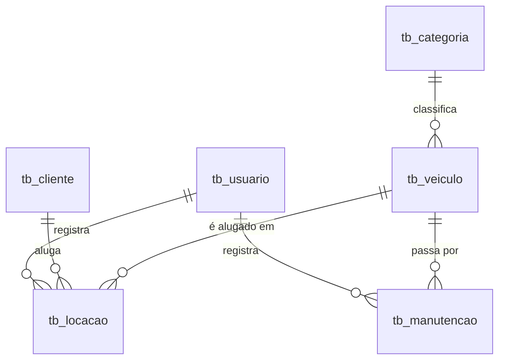

# 🚗 API para um sistema de Locadora de Veículos

Depois do sucesso da API da biblioteca, você foi promovido. Agora a empresa precisa de uma **API interna para uma locadora de veículos**, com regras de negócio bem mais exigentes: reservas por período, cálculo de valores, multas, taxas de cancelamento, controle de quilometragem, manutenção preventiva automática e níveis de permissão.

---

## 🗂 Modelo Relacional



| Tabela | Descrição |
|---|---|
| `tb_usuario` | Funcionários que acessam a API (perfil `ADMIN` ou `ATENDENTE`) |
| `tb_cliente` | Pessoas que alugam os veículos (CPF, CNH, data de nascimento) |
| `tb_categoria` | Define valor da diária, km livre, valor do km excedente e idade mínima |
| `tb_veiculo` | Frota da locadora, com quilometragem e situação |
| `tb_locacao` | Reservas e locações, do agendamento até o fechamento financeiro |
| `tb_manutencao` | Manutenções preventivas e corretivas dos veículos |

📥 [Clique aqui para baixar o script do banco de dados](bd_locadora.sql)

> ⚠️ O script exige **MySQL 8.0.16+** (ou MariaDB 10.2+), pois usa `CHECK` e colunas geradas.

---

## 🔐 Autenticação e Perfis (JWT)

- Autenticação baseada na tabela `tb_usuario`, com senha armazenada como **hash bcrypt**
- Endpoint `POST /login` gera o token JWT (validade de **8 horas**)
- O token deve carregar o `usu_cod` e o `usu_perfil`
- Usuários inativos não podem fazer login
- Todos os endpoints, exceto `/login`, devem ser protegidos

### Permissões

| Ação | ADMIN | ATENDENTE |
|---|:---:|:---:|
| Gerenciar usuários | ✅ | ❌ |
| Gerenciar categorias e veículos | ✅ | ❌ |
| Abrir e finalizar manutenções | ✅ | ❌ |
| Relatório de faturamento | ✅ | ❌ |
| Gerenciar clientes | ✅ | ✅ |
| Reservar, retirar, devolver e cancelar locações | ✅ | ✅ |
| Consultas (veículos disponíveis, locações, atrasos) | ✅ | ✅ |

- Token ausente, inválido ou expirado → **401**
- Token válido, mas sem permissão → **403**

---

## 🚀 Funcionalidades

### 🏷️ Categorias e 🚙 Veículos

- Cadastro, listagem, alteração e exclusão lógica
- A placa deve seguir o padrão Mercosul (`ABC1D23`) e ser única
- Um veículo novo começa como `DISPONIVEL`
- **Não** é permitido inativar:
  - um veículo que tenha locação `RESERVADA` ou `ATIVA`
  - uma categoria que tenha veículos não inativos
- A situação do veículo **não** pode ser alterada diretamente pelo `PUT`. Ela muda apenas como consequência de retirada, devolução, manutenção ou exclusão
- Alterar o preço de uma categoria **não** altera locações já reservadas (veja "Foto dos preços" abaixo)

### 👤 Clientes

- Cadastro, listagem, alteração e exclusão lógica
- CPF e CNH são únicos
- **Não** é permitido inativar um cliente que tenha locação `RESERVADA` ou `ATIVA`

---

### 📅 Reserva (`POST /locacoes`)

A reserva bloqueia um veículo para um período. Para criá-la, **todas** as regras abaixo precisam ser atendidas:

**Sobre o cliente**
1. Precisa estar ativo
2. A CNH deve estar válida **até a data prevista de devolução**
3. Precisa ter a idade mínima da categoria **na data da retirada**
4. Não pode ter nenhuma locação atrasada
5. Pode ter no máximo **2 locações em aberto** (`RESERVADA` + `ATIVA`)

**Sobre o período**
6. A data de retirada não pode estar no passado e pode estar no máximo **90 dias** à frente
7. A devolução prevista deve ser posterior à retirada
8. Duração mínima de **1 diária** e máxima de **30 diárias**

**Sobre o veículo**
9. Não pode estar `MANUTENCAO` ou `INATIVO`, e a categoria deve estar ativa
10. Não pode haver conflito de período com outra locação `RESERVADA` ou `ATIVA` do mesmo veículo

Dois períodos conflitam quando:

```text
inicio_novo < fim_existente  E  fim_novo > inicio_existente
```

📌 Para uma locação `ATIVA` que está atrasada, considere que o veículo está ocupado **até agora**, ou seja, `fim_existente = MAIOR(data_prevista, agora)`.

**Foto dos preços**

No momento da reserva, copie da categoria para a locação os campos `valordiaria`, `kmlivrediaria` e `valorkmexcedente`. Todos os cálculos futuros usam esses valores copiados, nunca os atuais da categoria.

**Valor previsto**

```text
diarias_previstas = ARREDONDAR_PARA_CIMA(horas entre retirada e prevista / 24)
valor_previsto    = diarias_previstas × valor_diaria
```

⚠️ Duas reservas simultâneas para o mesmo veículo não podem ser aceitas. Dentro da transação, bloqueie a linha do veículo com `SELECT ... FOR UPDATE` **antes** de verificar conflitos.

---

### 🔑 Retirada (`PUT /locacoes/:id/retirar`)

- Apenas locações `RESERVADA`
- Permitida a partir de **1 hora antes** do horário agendado e até o **fim do mesmo dia**
- O veículo deve estar `DISPONIVEL` no momento da retirada
- O cliente deve continuar ativo e com CNH válida
- O km de retirada é lido de `vei_kmatual`, nunca enviado pelo usuário
- Atualizações (em **transação**):
  - Locação → `ATIVA`, preenchendo `loc_dataretiradaefetiva` e `loc_kmretirada`
  - Veículo → `LOCADO`

---

### 🔄 Devolução (`PUT /locacoes/:id/devolver`)

Recebe no corpo o km atual do veículo: `{ "km": 20700 }`

- Apenas locações `ATIVA`, então uma locação já finalizada não pode ser devolvida novamente
- O km informado deve ser maior ou igual ao km de retirada

**Cálculo do valor final**

```text
1. Diárias cobradas
   horas_usadas     = horas entre retirada efetiva e devolução
   qtd_diarias      = ARREDONDAR_PARA_CIMA((horas_usadas - 1) / 24), mínimo 1
                      (existe 1 hora de tolerância)
   valor_diarias    = qtd_diarias × valor_diaria

2. Km excedente
   km_rodados       = km_devolucao - km_retirada
   km_livre         = qtd_diarias × km_livre_diaria
   valor_km_extra   = MAIOR(0, km_rodados - km_livre) × valor_km_excedente

3. Multa por atraso
   dias_atraso      = MAIOR(0, qtd_diarias - diarias_previstas)
   valor_multa      = dias_atraso × valor_diaria × 20%

4. Total
   valor_total      = valor_diarias + valor_km_extra + valor_multa
```

> A devolução antecipada não gera multa. O cliente paga apenas as diárias que usou.

📌 **Exemplo:** categoria Econômico (R$ 99,90/dia, 150 km livres/dia, R$ 0,75/km excedente)

| Dado | Valor |
|---|---|
| Retirada efetiva | 10/10/2026 09:00 |
| Devolução prevista | 13/10/2026 09:00 (3 diárias) |
| Devolução real | 14/10/2026 09:40 |
| Km retirada / devolução | 20.000 / 20.700 |

| Cálculo | Resultado |
|---|---|
| Horas usadas: 96h40 − 1h de tolerância = 95h40 → 3,99 → | **4 diárias** = R$ 399,60 |
| Km: 700 rodados − 600 livres = 100 × 0,75 | **R$ 75,00** |
| Atraso: 4 − 3 = 1 dia × 99,90 × 20% | **R$ 19,98** |
| **Total** | **R$ 494,58** |

**Atualizações (em uma única transação)**
- Locação → `FINALIZADA`, com todos os campos de fechamento preenchidos
- Veículo → `vei_kmatual` recebe o km de devolução
- Veículo → `DISPONIVEL`, **exceto** no caso da revisão automática abaixo

### 🔧 Revisão preventiva automática

Se, após a devolução, `vei_kmatual - vei_kmultimarevisao >= 10.000`:

- O veículo vai para `MANUTENCAO` em vez de `DISPONIVEL`
- Uma manutenção `PREVENTIVA` é criada automaticamente, com a descrição `Revisão dos XX.000 km`
- Tudo isso acontece **na mesma transação** da devolução. Se algo falhar, nada é gravado

---

### ❌ Cancelamento (`PUT /locacoes/:id/cancelar`)

Recebe no corpo o motivo: `{ "motivo": "CLIENTE" }` ou `{ "motivo": "EMPRESA" }`

- Apenas locações `RESERVADA`
- Regra da taxa:

| Situação | Taxa |
|---|---|
| Motivo `EMPRESA` (ex.: veículo quebrou) | R$ 0,00 |
| Motivo `CLIENTE`, com 24h ou mais de antecedência | R$ 0,00 |
| Motivo `CLIENTE`, com menos de 24h de antecedência | 1 diária |
| Motivo `CLIENTE`, depois do horário de retirada (*no-show*) | 1 diária |

- Grava `loc_datacancelamento`, `loc_motivocancelamento`, `loc_valortaxacancelamento` e `loc_valortotal`

📌 **Exemplo:** retirada agendada para 20/09 09:00 e cancelamento pelo cliente em 19/09 20:00 (13h antes). Taxa de **1 diária**.

---

### 🛠️ Manutenções (somente ADMIN)

**Abrir (`POST /manutencoes`)**
- O veículo deve estar `DISPONIVEL` (não é possível abrir para veículo `LOCADO` ou `INATIVO`)
- Apenas **uma** manutenção aberta por veículo
- O veículo vai para `MANUTENCAO`
- A resposta deve listar as reservas futuras do veículo, para que o atendente possa cancelá-las com motivo `EMPRESA`

**Finalizar (`PUT /manutencoes/:id/finalizar`)**
- Recebe o valor gasto: `{ "valor": 450.00 }`
- Manutenção → `FINALIZADA`, preenchendo `man_datafim` e `man_valor`
- Veículo → `DISPONIVEL`
- Se for `PREVENTIVA`, atualiza `vei_kmultimarevisao = vei_kmatual`

---

### ⏰ Consultas

- `GET /locacoes?situacao=RESERVADA|ATIVA|FINALIZADA|CANCELADA` filtra por situação
- `GET /locacoes/atrasadas` lista as locações `ATIVA` com `data prevista < agora`, incluindo as horas de atraso
- `GET /veiculos/disponiveis?inicio=...&fim=...` lista os veículos livres no período (mesma regra de conflito da reserva)
- `GET /relatorios/faturamento?inicio=...&fim=...` (ADMIN) mostra o total por categoria, separando diárias, km extra, multas e taxas de cancelamento

---

## 🚦 Códigos de resposta esperados

| Código | Quando usar |
|---|---|
| `200` / `201` | Sucesso / recurso criado |
| `400` | Dados inválidos ou ausentes (formato de placa, datas, campos obrigatórios) |
| `401` | Sem token, token inválido ou expirado |
| `403` | Perfil sem permissão |
| `404` | Recurso não encontrado |
| `409` | Conflito (período ocupado, CPF ou placa duplicados) |
| `422` | Violação de regra de negócio (CNH vencida, idade mínima, cliente com atraso, situação inválida) |

As mensagens de erro devem explicar **qual** regra foi violada, por exemplo: `"Cliente não possui idade mínima (25 anos) para a categoria SUV"`.

---

## 🧪 Cenários de teste (dados do script)

| Cenário | Resultado esperado |
|---|---|
| Bruno (20 anos) reserva um SUV | ❌ 422: idade mínima |
| Bruno reserva um Econômico | ✅ Permitido |
| Carla reserva qualquer veículo | ❌ 422: CNH vencida |
| Diego reserva qualquer veículo | ❌ 422: cliente inativo |
| Eduarda tenta uma nova reserva | ❌ 422: possui locação atrasada |
| Reserva do Compass entre +4 e +6 dias a partir de hoje | ❌ 409: conflita com a reserva da Ana |
| Reserva do Creta | ❌ 422: em manutenção |
| Reserva do Virtus | ❌ 422: veículo inativo |
| Kwid alugado e devolvido com 200 km rodados | ✅ Vai para `MANUTENCAO` com revisão criada |
| Devolver a locação 1 (já finalizada) | ❌ 422: situação inválida |
| Atendente tenta `POST /veiculos` | ❌ 403 |
| Login com `admin@locadora.com` / `123456` | ✅ Token com perfil ADMIN |

---

## ✅ Resumo das Funcionalidades

- [ ] Login JWT com perfis ADMIN e ATENDENTE
- [ ] CRUD de usuários (ADMIN)
- [ ] CRUD de categorias e veículos com exclusão lógica (ADMIN)
- [ ] CRUD de clientes com exclusão lógica
- [ ] Reserva com validação de cliente, período e conflito de datas
- [ ] Controle de concorrência na reserva (`SELECT ... FOR UPDATE`)
- [ ] Retirada com janela de horário
- [ ] Devolução com cálculo de diárias, km excedente e multa
- [ ] Revisão preventiva automática a cada 10.000 km
- [ ] Cancelamento com taxa conforme antecedência e motivo
- [ ] Abertura e finalização de manutenções
- [ ] Consultas de disponibilidade, atrasos e faturamento
- [ ] Uso de transações em todas as operações que alteram mais de uma tabela

---

## 🎯 Endpoints

```text
POST   /login

POST   /usuarios
GET    /usuarios
PUT    /usuarios/:id
DELETE /usuarios/:id

POST   /categorias
GET    /categorias
PUT    /categorias/:id
DELETE /categorias/:id

POST   /veiculos
GET    /veiculos
GET    /veiculos/disponiveis?inicio=&fim=
PUT    /veiculos/:id
DELETE /veiculos/:id

POST   /clientes
GET    /clientes
PUT    /clientes/:id
DELETE /clientes/:id

POST   /locacoes
GET    /locacoes?situacao=
GET    /locacoes/atrasadas
PUT    /locacoes/:id/retirar
PUT    /locacoes/:id/devolver
PUT    /locacoes/:id/cancelar

POST   /manutencoes
GET    /manutencoes
PUT    /manutencoes/:id/finalizar

GET    /relatorios/faturamento?inicio=&fim=
```

---

## 🏁 Desafio extra

- Escreva testes automatizados para o cálculo da devolução, cobrindo a tolerância de 1h, a devolução antecipada, o km excedente e o atraso
- Simule duas reservas simultâneas para o mesmo veículo e prove que apenas uma é aceita
- Valide o dígito verificador do CPF
- Permita trocar o veículo de uma reserva por outro da mesma categoria quando o original entrar em manutenção
